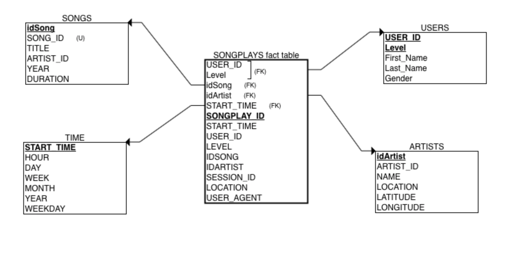

#  Data Modeling with Postgres & ETL Pipeline for Sparkify 
***
## Udacity Data Engineer Nano Degree Project 1
***
### Introduction

A startup called Sparkify wants to analyze the data they've been collecting on songs and user activity on their new music streaming app. The analytics team is particularly interested in understanding what songs users are listening to. Currently, they don't have an easy way to query their data, which resides in a directory of JSON logs on user activity on the app, as well as a directory with JSON metadata on the songs in their app.

### The goal
***
The purpose of this project is to define fact and dimension tables for a star schema for a particular analytic focus, and write an ETL pipeline that transfers data from files in two local directories into these tables in Postgres using Python and SQL.

### Original Udacity Schema for Song Play Analysis
***
Using the song and log datasets, the projects wants a star schema optimized for queries on song play analysis. This includes the following tables.

#### Fact Table:
**songplays** - records in log data associated with song plays i.e. records with page **NextSong**\
*songplay_id, start_time, user_id, level, song_id, artist_id, session_id, location, user_agent*

#### Dimension Tables
**users** - users in the app\
*user_id, first_name, last_name, gender, level*\
**songs** - songs in music database\
*song_id, title, artist_id, year, duration*\
**artists** - artists in music database\
*artist_id, name, location, latitude, longitude*\
**time** - timestamps of records in songplays broken down into specific units\
*start_time, hour, day, week, month, year, weekday*

### Personal Schema for Song Play Analysis
***

### Tableau Analysis
***
#### Songplays by Artist
There are so many NULL in Song and Artist Dimension.

#### Songplays by Hour

#### Songplays by Day (November)

